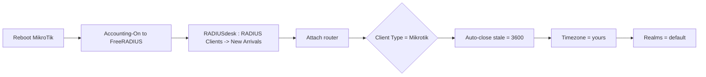

# Droplet-side setup

What to do on the DigitalOcean droplet after the MikroTik phases are applied.

## 1. Swap the MikroTik WireGuard peer key

The router was factory-reset, so its old WireGuard key is dead.

```bash
# after Phase 2 prints the MikroTik public key, run:
sudo ./update-wireguard-peer.sh <NEW_MIKROTIK_PUBLIC_KEY>
sudo wg show wg0        # confirm the peer + fresh handshake
```

What the script does:

```
STEP                    WHERE                  RESULT
remove old peer         wg0 (live) + wg0.conf  dead key gone
add new peer            wg0 (live) + wg0.conf  AllowedIPs 10.10.10.2/32
keepalive 25s           both sides             survives Starlink NAT/IP changes
no Endpoint line        droplet side           learns endpoint from each handshake
```

If you prefer to edit by hand, the peer block in `/etc/wireguard/wg0.conf`
should end up as:

```ini
[Peer]
PublicKey = <NEW_MIKROTIK_PUBLIC_KEY>
AllowedIPs = 10.10.10.2/32
PersistentKeepalive = 25
```

No `Endpoint =` line. Remove the old one if present.

## 2. Firewall check (host firewall)

RADIUS + WireGuard must be reachable from the tunnel source `10.10.10.2`:

```bash
sudo ufw allow 51820/udp            # WireGuard (already worked before)
sudo ufw allow from 10.10.10.2 to any port 1812 proto udp    # auth
sudo ufw allow from 10.10.10.2 to any port 1813 proto udp    # accounting
sudo ufw status
```

FreeRADIUS + RADIUSDesk themselves run on 1812/1813 inside the droplet, so no
application-level change is needed for the RADIUS client itself - RADIUSDesk
handles dynamic RADIUS clients via its site-wide shared secret.

## 3. Verify RADIUS end-to-end

Watch FreeRADIUS while you reboot the MikroTik (it should send Accounting-On):

```bash
sudo freeradius -X        # tail the debug output; reboot the router
```

You are looking for the router's Accounting-On / Access-Request arriving from
`10.10.10.2`.

## 4. RADIUSDesk - onboard the router as a RADIUS Client

Follow the current RADIUSDesk docs (`RADIUS Clients` + `New Arrivals`).



1. **Site-wide shared secret** - the secret you put in the MikroTik
   `/radius` entry (Phase 3) must equal RADIUSDesk's site-wide secret.
   Find/confirm it in the RADIUSDesk GUI before rebooting the router.
2. Open **RADIUS Clients** applet → the **New Arrivals** tab (collapsed by
   default, launch from the New Arrivals button).
3. The router appears identified by its NAS-Identifier
   (`njeremoto-cafe-01`, set in Phase 0). Click **Attach**.
4. Give it a name, set **Client Type = Mikrotik** (this is what makes
   disconnects work via CoA/DM on UDP 1700).
5. Enhancements: enable **Auto close stale sessions = 3600** s.
6. Set the **timezone** to yours (used for time-restriction logic).
7. Leave Monitor/Maps/Realms defaults (realms = the default realm).

After saving, reboot the MikroTik once more - the client should then show as
contacted.

## 5. Profiles, permanent users, vouchers

**Profile (component-based, use "Simple Edit"):**
- Add a bandwidth component → this becomes `Mikrotik-Rate-Limit`, e.g.
  `5M/5M` (rx/tx from the router's point of view: client upload/download).
- Optional components: total-data cap, time cap, valid-from/to dates.

**Vouchers** - batch generate under the profile. Use the *same value* for
username and password (the custom login page's Voucher tab auto-fills both),
e.g. a 12-char code.

**Permanent users** - create a long-term user (e.g. the cafe owner) under the
profile for username/password login.

Statistics come from RADIUS **accounting**: the hotspot profile already sends
interim updates every 10 minutes (`radius-interim-update=00:10:00`), so the
RADIUSDesk Activity Monitor will show live usage per user/voucher without
extra configuration.

## 6. Disconnect (CoA) test

We gave RADIUSDesk the ability to kick users: RADIUSDesk sends a
Disconnect-Request to the MikroTik on UDP 1700, and RouterOS terminates the
session. Test the "disconnect" button on an active session from RADIUSDesk.
If it fails, check:

- the RADIUS Client's **Client Type** is `Mikrotik`
- `/radius incoming print` on the router shows `accept=yes port=1700`
- `wg1` is in the LAN interface list (Phase 3 step 4) so the firewall lets the
  packet in